# Analysis of employee turnover causes based on decision tree and H2O machine learning model

# Directory

1. [Business situation and problem analysis](#business-situation-and-problem-analysis)

2. [Dataset overview and preprocessing](#dataset-overview-and-preprocessing)

   2.1. [Introduction to the dataset](#introduction-to-the-dataset)

   2.2. [Description of the dataset fields](#description-of-the-dataset-fields)

   2.3. [Data preprocessing](#data-preprocessing)

3. [Demographic analysis](#demographic-analysis)

4. [Analysis of income, department and position](#analysis-of-income,-department-and-position)

   4.1. [Revenue analysis](#revenue-analysis)

   4.2. [Sector analysis](#sector-analysis)

   4.3. [Job analysis](#job-analysis)

5. [Work status analysis](#work-status-analysis)

   5.1. [Overtime analysis](#overtime-analysis)

   5.2. [Satisfaction analysis](#satisfaction-analysis)

   5.3. [Performance rating analysis](#performance-rating-analysis)

   5.4. [Work-life balance analysis](#work-life-balance-analysis)

6. [Correlation analysis](#correlation-analysis)

   6.1. [Correlation coefficient matrix](#correlation-coefficient-matrix)

   6.2. [Bivariate analysis](#bivariate-analysis)

7. [Decision tree](#decision-tree)

   7.1. [Split the training set and test set](#split-the-training-set-and-test-set)

   7.2. [Decision tree modeling and visualization](#decision-tree-modeling-and-visualization)

   7.3. [Evaluate decision tree model performance](#evaluate-decision-tree-model-performance)

   7.4. [Feature importance analysis](#feature-importance-analysis)

8. [H2o machine learning model](#h2o-machine-learning-model)

   8.1. [Introduction to the h2o model](#introduction-to-the-h2o-model)

   8.2. [Split the training set, test set, and validation set](#split-the-training-set,-test-set,-and-validation-set)

   8.3. [Build a model](#build-a-model)

   8.4. [Model sorting](#model-sorting)

   8.5. [Feature importance](#feature-importance)

9. [Management implications](#management-implications)

10. [Appendix list of packages](#appendix-list-of-packages)


# Business Situation and Problem Analysis

"Managers tend to blame all their problems on things that are in the
sun, and tend to ignore the essence of the matter: people don't leave
their jobs, people leave managers. ---Travis Bradburly.

The purpose of this project is to make some recommendations for
enterprises to reduce the attrition rate. There are many possible causes
of employee turnover:

-   In search of better opportunities.

-   Negative work environment.

-   Poor management of the company.

-   Illness (and even death).

-   Excessive working hours.

By examining this data set, we will obtain more accurate important
factors that affect employee turnover and help enterprises reduce the
attrition rate. See the appendix for package support used.

# Dataset overview and preprocessing

## Introduction to the dataset

The data set "IBM HR Analytics Employee Attrition & Performance" was
downloaded from this
[link](https://www.kaggle.com/datasets/pavansubhasht/ibm-hr-analytics-attrition-dataset/).

It's a fictitious dataset created by IBM data scientists to uncover the
factors that contribute to employee turnover and explore relevant
important questions such as "segmenting distance from home based on job
role and employee attrition" or "comparing average monthly earnings
for different education levels and employee attrition."

## Description of the dataset fields

Table 1 shows the dataset fields and their descriptions.

Table 1. Dataset fields and their descriptions

|The name of the field|Description of the field|The name of the field|Description of the field|
|-------------------------|----------------|--------------------------|--------------|
|Age|age|Attrition|Whether or not to churn|
|Department|Affiliation|DistanceFromHome|km distance from home|
|EmployeeCount|1|EmployeeNumber|Number of employees|
|HourlyRate|Hourly rate|JobInvolvement|Engagement|
|JobSatisfaction|Job satisfaction MaritalStatus|Marital status|
|NumCompaniesWorked|How many companies have you worked for|Over18|Whether you are older than 18 years old|
|PerformanceRating|Performance ratings|RelationshipSatisfaction|Relationship satisfaction|
|TotalWorkingYears|Total number of years of service|TrainingTimesLastYear|Number of times you have been trained in the last year|
|YearsInCurrentRole|Number of years of experience in the current positionYearsSinceLastPromotion|The number of years since the last promotion|
|BusinessTravel|Travel status (never-travel, indefinitely, frequently)|DailyRate|Daily|
|Education|Level of|EducationField|Education|
|education|field|
|EnvironmentSatisfaction|Satisfaction with the work environment|Gender|gender|JobLevel|Job level|JobRole|Job Title|
|MonthlyIncome|Monthly income|MonthlyRate|Monthly rate|
|OverTime|Whether or not to work overtime|PercentSalaryHike|Salary increase percentage|
|StandardHours|Standard hours worked|StockOptionLevel|Stock option levels|
|WorkLifeBalance|Work-life balance|YearsAtCompany|Number of years of employment with the current company|
|YearsWithCurrManager|Number of years of work with the current manager|
## Data preprocessing

### Use the glimpse() function to preview the dataset

In this section, we will use the glimpse() function of the tidyverse
package to preview the dataset and see the structure and the first few
lines of the dataset.

```
df %>% glimpse()
```

See the results Fig 1. This dataset has 35 fields,1470 pieces of data.

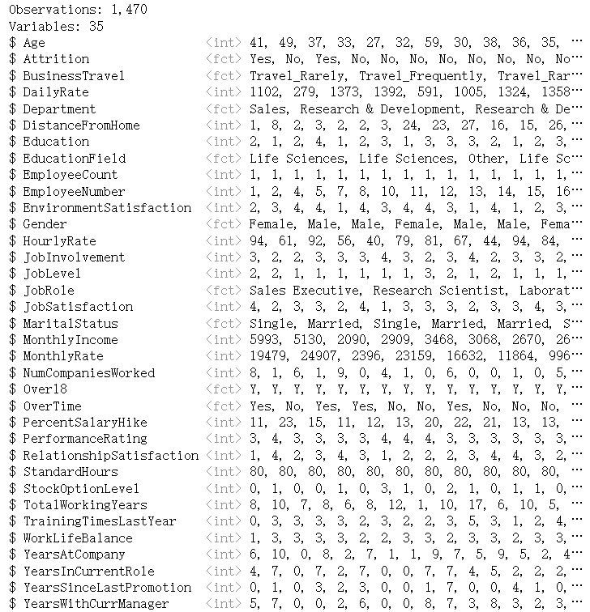

Fig 1 Use the glimpse() function to preview the dataset

### Check to see if there are any missing values

Use the is.na() method to check if there are any missing values.

```
any(is.na())
```

See the results Fig 2. Fortunately, there are no missing values in this
dataset, and no additional processing is required for missing values.

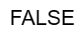

Fig 2 There are no missing values

### Replace with Chinese

To improve the readability of the chart, translate the content and
column names into Chinese and save them as df_zh.

The preferred way to replace the content with Chinese is to use mutate
and case_when methods, and some of the codes are as follows.

```
df %>%
mutate(Gender = case_when(
Gender == "Male" ~ "Male",
Gender == "Female" ~ "女",
TRUE ~ Gender
))
```

Next, define a column name that uses rename to translate.

```
# Rename the column name
df_zh <- rename(df_zh, setNames(names(df_zh), col_names))
```

The revised data can be found here Fig 3.

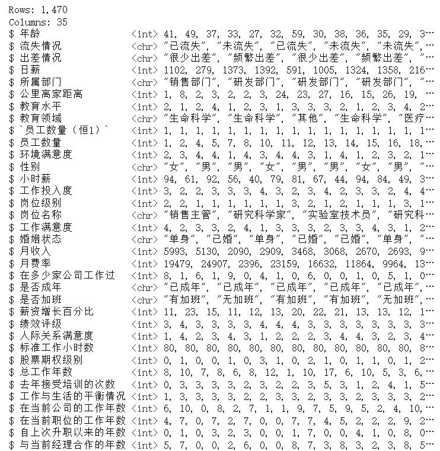

Fig 3 Preview of the translated data

# Demographic analysis

Demographic analysis is an essential part of the basic analysis, andthis section analyzes the impact of demographic characteristics on theattrition. Items in the dataset that address demographic characteristicsinclude gender, generation, marital status, and education level.

Among them, the generations come from the division of age, 3 under 7years old belong to the millennial generation, 3 7 to 54 years oldbelong to Generation X, 54 to 73 years old belong to the baby boomergeneration, and over 73 years old belong to the silent generation. Thecode is as follows:

```
df_zh$ Generations <- ifelse(df_zh$age<37, "Millennials",
ifelse(df_zh$age>=38 &df_zh$age<54, "Generation X",
ifelse(df_zh$age>=54 & df_zh$age<73, "baby boomers",
"Generation Silent"
)))
```

Draw a stacked histogram for analysis, and some of the codes are as follows.

```
p <-
df_zh %>%
select(intergenerational, churn) %>%
group_by (intergenerational, churn) %>%
summarize(n=n()) %>%
mutate(pct=round(prop.table(n),2) * 100) %>% arrange(desc(pct))
%>%
mutate(generational = factor(generation, levels=c("Millennials",
"Generation X", "Baby Boomers", "Silent Generation"))) %>%
ggplot(aes(x=fct_reorder(intergenerational, pct), y=pct, fill=churn,
color=churn)) +
geom_bar(stat="identity", color="black", size=.2, width=0.6,
position="fill")
```

Fig 4 It is a map of the distribution of population characteristics. The left column is a normal stacked histogram, and the right column is a percentage stacked histogram.

1.  There are more male employees than women, and the turnover is almost the same for different genders.

2.  Millennials are the most numerous, followed by Gen X. Millennials have the largest percentage of churn and Gen X has the least churn.

3.  In terms of marital status, the most employees are married, followed by single, and divorced employees are the least. Single employees have the highest rate of attrition, with the same rate of attrition among married and divorced employees.

4.  In terms of education level, according to the number of employees, from small to large, they are bachelor's degree, master's degree, bachelor's degree, bachelor's degree or less, and doctorate. The turnover rate of employees with a bachelor's degree or less is the largest, and the turnover of employees with a doctorate degree is the smallest.

Overall, attrition correlates poorly with gender, with millennials, single, or under-undergraduate employees more likely to leave their jobs, and Gen Xers, divorced, and Ph.D. employees less likely to leave their jobs.

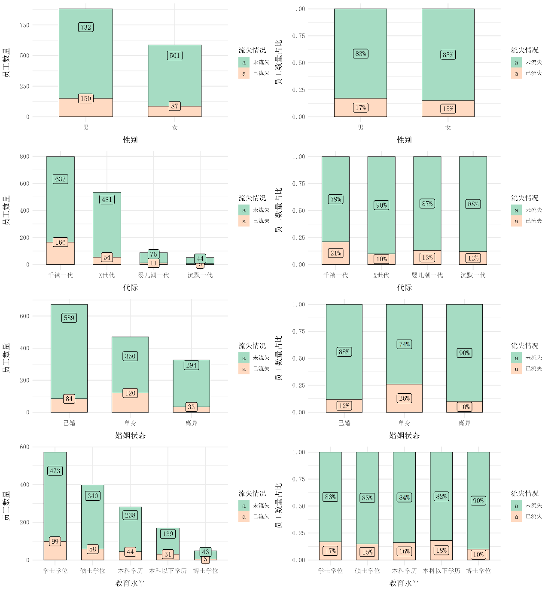

Fig 4 Distribution of demographic characteristics

# Analysis of income, department and position

## Revenue analysis

In this section, the level of income will be examined in terms of monthly income.

### The impact of revenue on churn

Plot the density of the building to measure the impact of monthly income on churn. Some of the codes are as follows.

```
p1 <-
df_zh %>%
ggplot(aes(x = monthly income, fill = churn, group = churn)) +
geom_density(alpha=.6, size=.3, position="fill")
```
Fig 5 It shows the impact of monthly income on churn. Employees withlower monthly incomes are more likely to churn. The monthly income ofabout 16,000 has a zero point, which does not conform to thedistribution law, probably due to imperfect data collection.

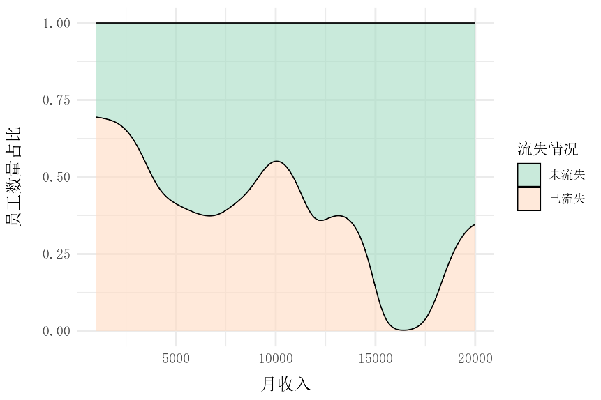

Fig 5 The impact of monthly income on churn

### The impact of demographic characteristics on income

This section combines the demographic characteristics in Section 4 toanalyze the impact of demographic characteristics on income throughscatter plots and measure churn. Some of the codes are as follows.

```
p <- df_zh %>%
select(Churn, Monthly Income, Gender) %>%
ggplot(aes(x=monthly income, y=gender)) +
geom_jitter(aes(col=churn), alpha=0.5).
```

Fig 6 The impact of four demographic characteristics on income is
demonstrated.

1.  Men tend to be lower than women.

2.  Millennials tend to be the most low-income, and Gen X is the most evenly distributed in terms of income levels.

3.  The effect of marital status on income is not significant.

4.  Bachelor's degrees tend to be the most low-income, while doctoral degrees are most evenly distributed in terms of income levels.

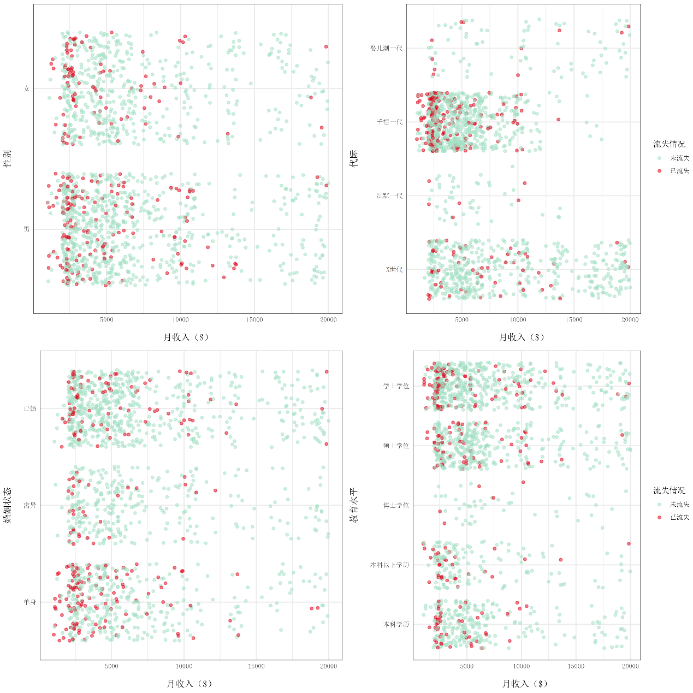

Fig 6 The impact of demographic characteristics on monthly income

### The impact of income on salary growth

According to Fig 7, with no significant impact on income and wage growth.The monthly income is concentrated below 70,000 $, and the salarygrowth is more evenly distributed, with 10-15% being relatively more.The lower the salary increase, the easier it is to churn.

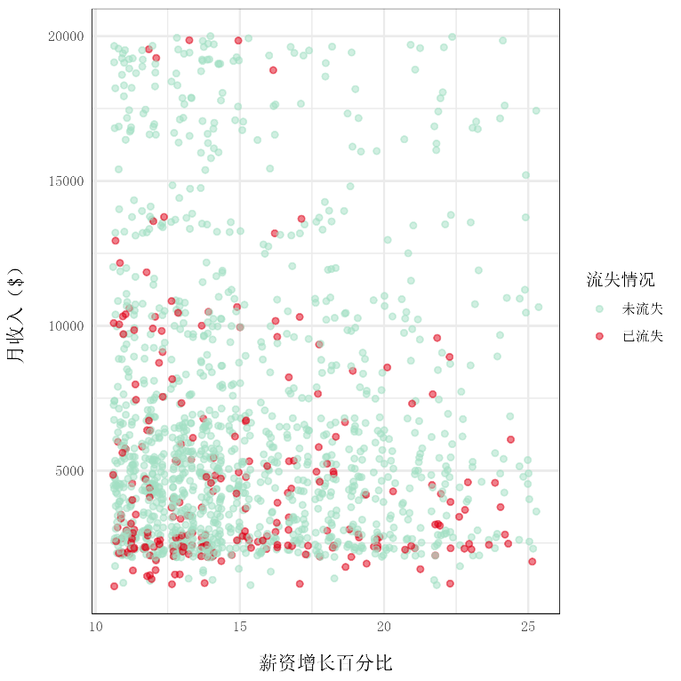

Fig 7 The impact of income on salary growth

## Sector analysis

### The impact of the employee's department on attrition

The dataset involves three departments: R&D, sales, and human resources.

Draw a pyramid chart to analyze the impact of the employee's department on churn, some of the codes are as follows.

```
attr.dep <- df_zh %>% group_by(department, churn) %>%
summarize(amount=n()) %>%.
mutate(pct=round(prop.table(amount),2) * 100) %>% arrange(pct)
yes.attr <- attr.dep %>% filter(churn == "churned") %>%
arrange(department).
library(plotrix)
par(mar = pyramid.plot(no.attr$pct, yes.attr$pct,
labels = unique(attr.dep$ department), top.labels=c("not churned",
"," churned),
gap=30, show.values = T, rxcol = yesfunc(9), lxcol = nofunc(9)))
```

Fig 8 It shows the impact of the employee's department on churn.
Employees in the sales department are the most likely to lose money.

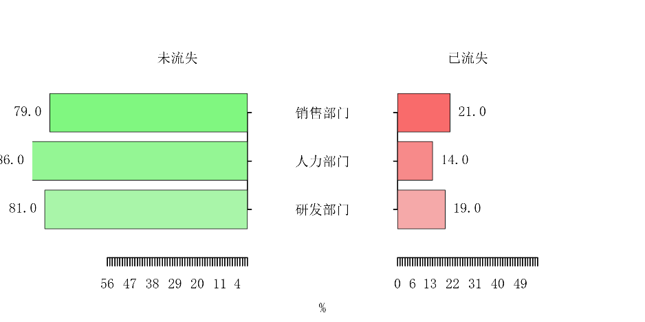

Fig 8 The impact of the employee's department on attrition

### The impact of the sector on revenue

Fig 9 It shows the impact of the department on income and salary growth.Compared to the other two sectors, the R&D department is more likely tobe low-income. Salary increases are evenly distributed and are notaffected by the department to which they belong.
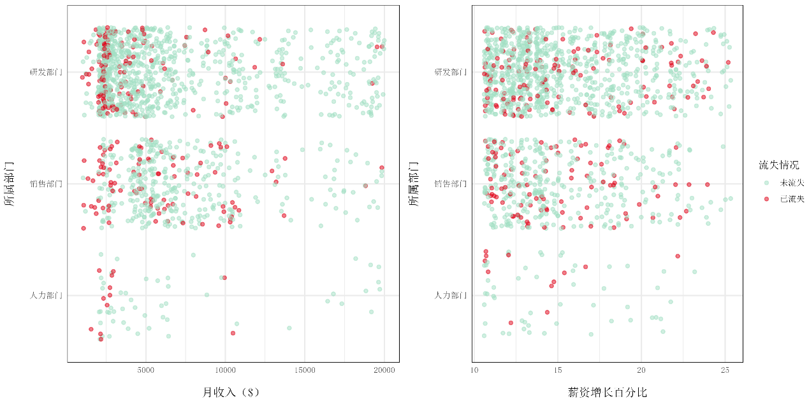

Fig 9 The impact of the sector on revenue

## Job Analysis

### The impact of the post on attrition

The dataset includes 9 positions: sales executive, research scientist,laboratory technician, manufacturing director, medical representative,manager, sales representative, research director, and human resources.

Fig 10 A pyramid chart shows the impact of employee positions onattrition. Sales reps are the most susceptible to attrition, followed bymedical reps and research directors, research scientists, and HRemployees are the least susceptible to attrition.

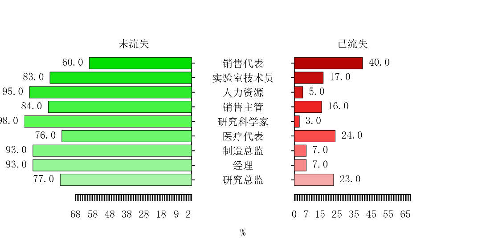

Fig 10 The impact of employee positions on attrition

### The impact of the position on income

Fig 11 It shows the impact of the position on income and salary growth.In the statistics, research scientists, sales representatives,laboratory technicians, human resources employees are more inclined tobe low-income, and research directors, managers are more inclined to behigh-income. Jobs have less of an impact on salary growth.

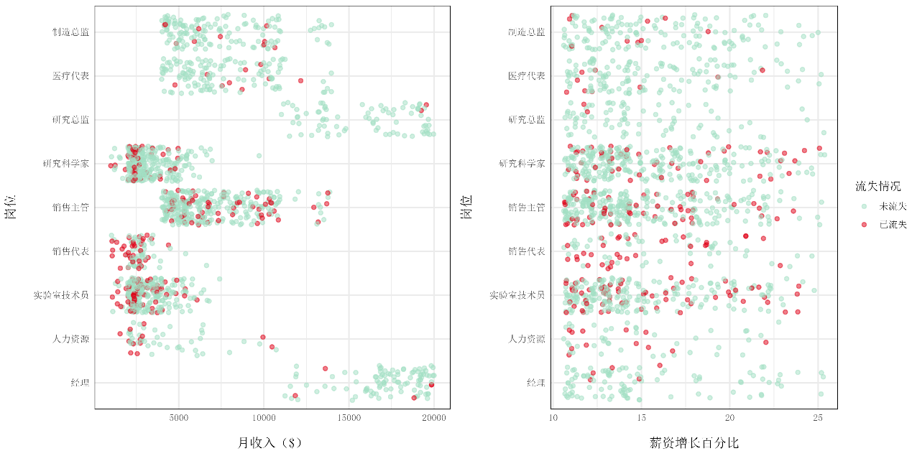

Fig 11 The impact of the position on income and salary growth

# Work status analysis

This section examines the status of employees through overtime, satisfaction, performance ratings, and work-life balance.

## Overtime analysis

### The impact of overtime on churn

Fig 12 The impact of overtime on churn is demonstrated. Overtime isunevenly distributed in the dataset, and the turnover rate of employeeswith overtime is as high as 31%. Overtime can be a factor that can havea significant impact on employee turnover.

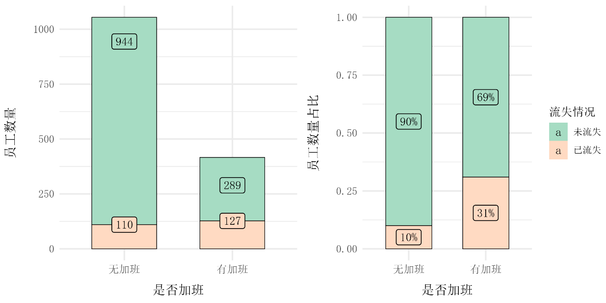

Fig 12 The impact of overtime on churn

### The impact of demographics on overtime

Fig 13 The impact of demographics on overtime is demonstrated.

1.  In terms of gender, women work slightly higher overtime than men.

```{=html}
<!-- -->
```
1.  In terms of generations, baby boomers and silent generations have a slightly higher percentage of overtime, and Gen X and millennials have a slightly lower percentage of overtime. So young people are less willing to work overtime.

2.  In terms of marital status, the proportion of overtime work is slightly higher for divorced employees.

3.  In terms of education level, the proportion of overtime work with a bachelor's degree or less is slightly higher.

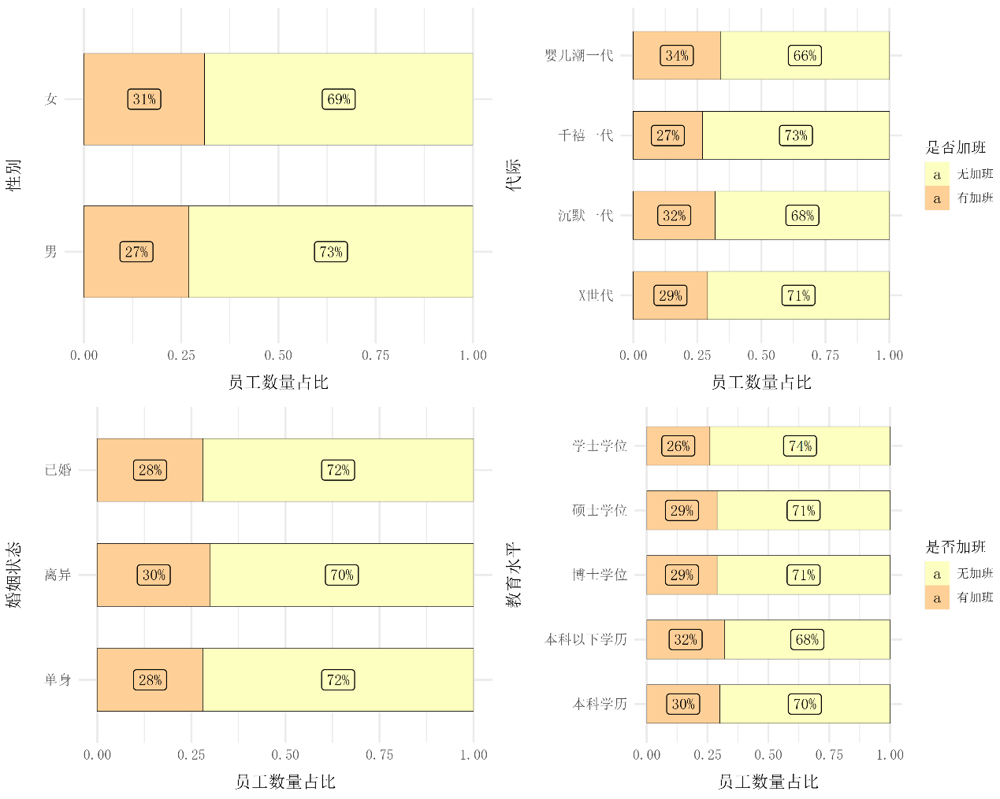

Fig 13 The impact of demographics on overtime

### The impact of departments and positions on overtime

Fig 14 It shows the influence of departments and positions on overtime.The department has no significant impact on overtime, but the positionhas a certain impact on overtime, and the overtime situation of researchscientists is the most serious.

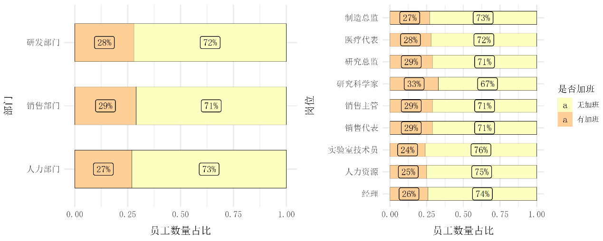

Fig 14 The impact of departments and positions on overtime

## Satisfaction analysis

### The impact of satisfaction on churn

Satisfaction is divided into three aspects: environmental satisfaction,interpersonal relationship satisfaction, and job satisfaction.Fig 15 The impact of three types of satisfaction on churn is demonstrated. As youcan see, the lower the satisfaction, the more churn will be.

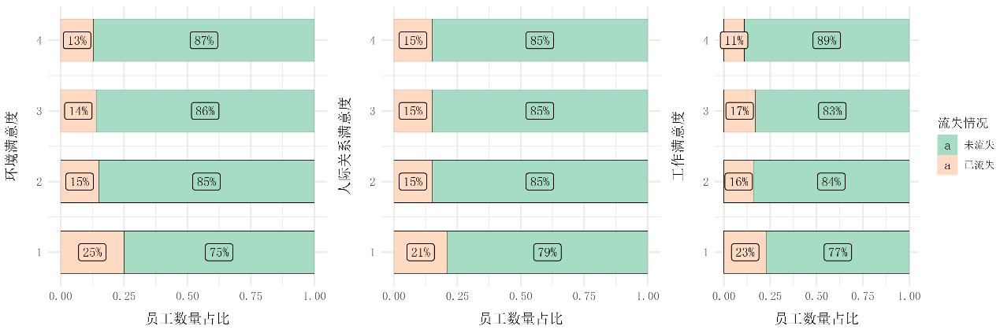

Fig 15 The impact of satisfaction on churn

### The impact of employee department and position on satisfaction

Analyze the impact of employee departments and positions on satisfaction by drawing a stacking density diagram, and some of the codes are as follows.

```
library(viridis)
ggplot(aes(x=job title, group=job satisfaction, fill=job
satisfaction)) +
geom_density(adjust=1.5, position="fill", size=0.5) +
# Color Sets
scale_fill_viridis(alpha=0.8) +
# Set the legend order
guides(fill = guide_legend(reverse=FALSE))
```

Fig 16 It shows the impact of departments and positions on satisfaction.

1.  In terms of interpersonal relationships, the human resources department is the most satisfied, and the manufacturing director is the most satisfied.

2.  In terms of environment, the R&D department is the most satisfied, the human resources department is the least satisfied, the manager is the most satisfied, and the sales supervisor is the most dissatisfied.

3.  In terms of work, the sales department is the most satisfied, and the human resources department is less satisfied, and there is no significant difference in job satisfaction.

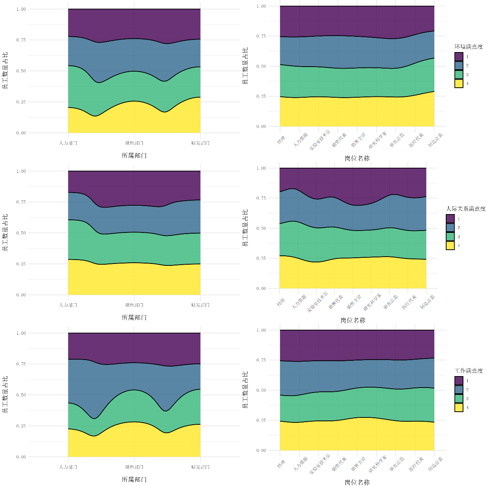

Fig 16 The impact of departments and positions on satisfaction

## Performance rating analysis

Composed Fig 17 Yes, performance ratings have no effect on churn.

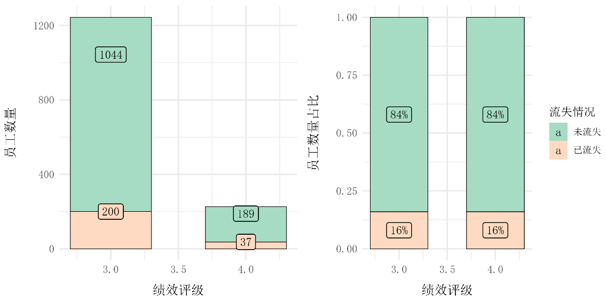

Fig 17 The impact of performance ratings on churn

## Work-life balance analysis

### The impact of work-life balance on churn

Fig 18 It shows the impact of work-life balance on churn. The worst balance is the worst for churn, followed by the best for the balance.

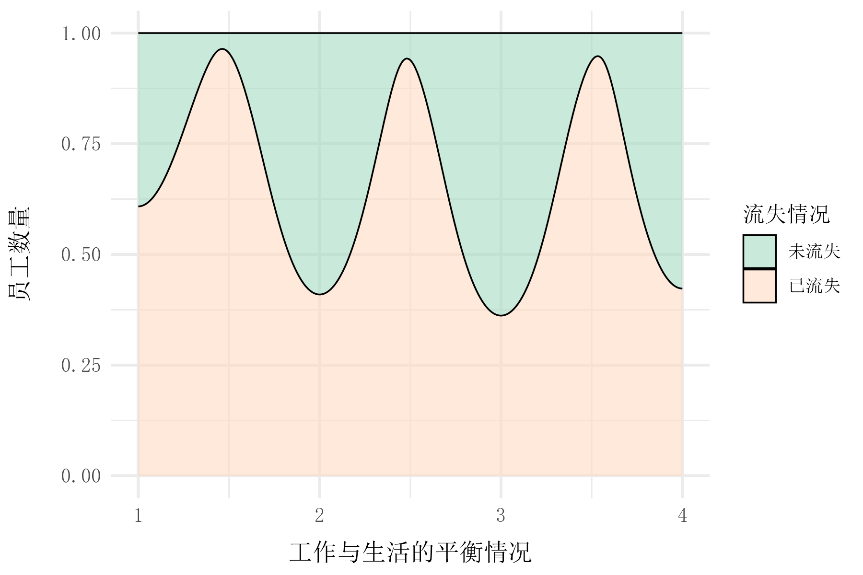

Fig 18 The impact of work-life balance on churn

### The impact of the employee's department and position on the work-life balance

Fig 19 It shows the impact of employees' departments and positions onwork-life balance. Departments and positions have little impact on thebalance, the balance of the human resources department is slightlybetter, and the loss of experimental technicians with the worst balanceis the most serious.

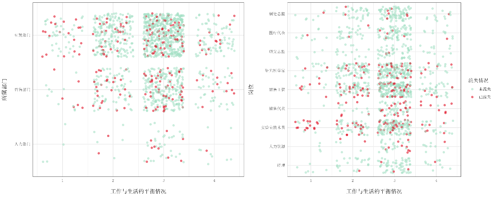

Fig 19 The impact of departments and positions on work-life balance

# Correlation analysis

First, the non-integer columns are encoded as integers, and some of the codes are as follows.

```
df_train <- df %>% mutate(Gender = ifelse(Gender == "Male", 1,
ifelse(Gender == "Female", 0, Gender)))
df_train$Gender <- as.integer(df_train$Gender)
```

## Correlation coefficient matrix

In this section, the three constant factors are eliminated, and the
correlation analysis of the remaining numerical factors is carried out,
and the correlation coefficient matrix is plotted using ggcorrplot. Some
of the codes are as follows.

```
# Delete the constant column
df_zh <- select(df_zh, -'Number of employees(constant 1)')
df_zh <- select(df_zh, -'Adult')
df_zh < - select(df_zh, -'standard working hours').
# Filter the numeric column
nums <- select_if(df_train, is.numeric)
#计算相关系数
corr <- round(cor(nums), 1)
# Significant discrepancies are recorded
p.mat <- cor_pmat(nums)
# Draw a correlation matrix
ggcorrplot(corr, method = "circle", type = "upper",
ggtheme = ggplot2::theme_bw(), title = "", show.legend = TRUE,
legend.title = "Corr", show.diag = T, colors = c("#839EDB",
"white", "#ed5737"),
outline.color = "white", hc.order = T, hc.method = "complete",
lab = T,
lab_col = "black", lab_size = 2, p.mat = p.mat, sig.level = 0.05,
insig = "blank", pch = 4, pch.col = "black", pch.cex = 5, tl.cex
= 12,
tl.col = "black", tl.srt = 45, digits = 2)
```

Fig 20 is the correlation matrix. It can be seen that there is a strong
positive correlation between the total number of years of work and the
job level and monthly income. There is a strong positive correlation
between monthly income and position and age. There is a strong positive
correlation between performance ratings and salary growth.

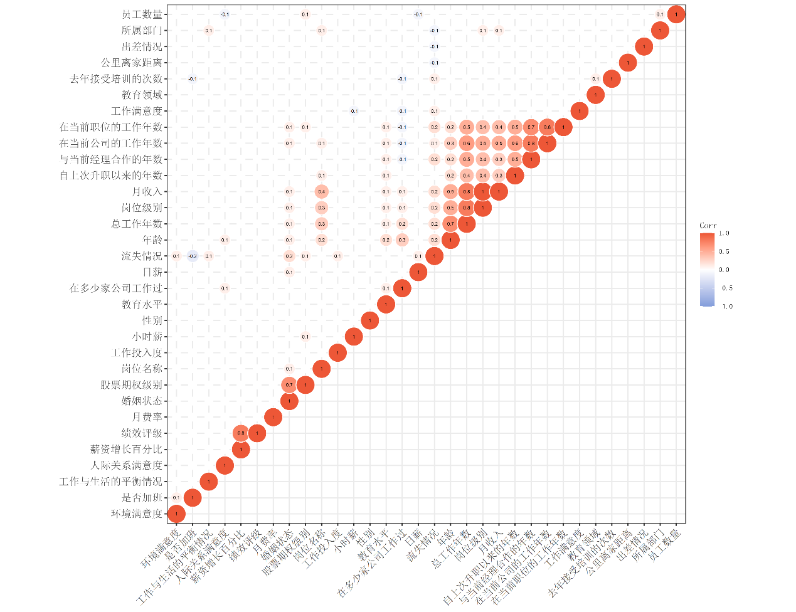

Fig 20 Correlation coefficient matrix

## Bivariate analysis

This section performs a bivariate analysis of the highly correlated
variables in the previous section, including total years of employment,
age, number of years of employment in the current company, number of
years of employment in the current position, and monthly earnings. Since
there is no significant relationship between performance ratings and
churn, they are not discussed here. Scatter and smoothness curves are
plotted for bivariate analysis, and some of the codes are as follows.

```
df_zh %>% ggplot(aes(x=total years of work, y=monthly income)) +
geom_point(color = "#c4e3ba", alpha=1/2) +
geom_smooth(method="loess", color="red")
```

Fig 21 Charts showing four bivariate analyses.

1.  The monthly income increases significantly with the more years of total service, but the monthly income shrinks when it reaches 35 years, and the monthly income varies greatly between different employees when the total number of years of service reaches 35 years.

```{=html}
<!-- -->
```
5.  The older you get, the more you get older, your monthly income increases to a certain extent, but when you reach the age of 50, your monthly income shrinks significantly, and there is a big difference between the monthly income of employees under the age of 20 and those over the age of 50.

6.  The more years of service in the current company, the significant increase in monthly income, and the monthly income tends to be stable when it reaches 35 years, and the monthly income of different employees in the current company for 35 years varies greatly.

7.  The more years of work in the current position, the significant increase in monthly earnings, and there is no tendency to retract, on the contrary, the acceleration is increasing, just. The difference in monthly earnings increases as the number of years of service in the current position increases.

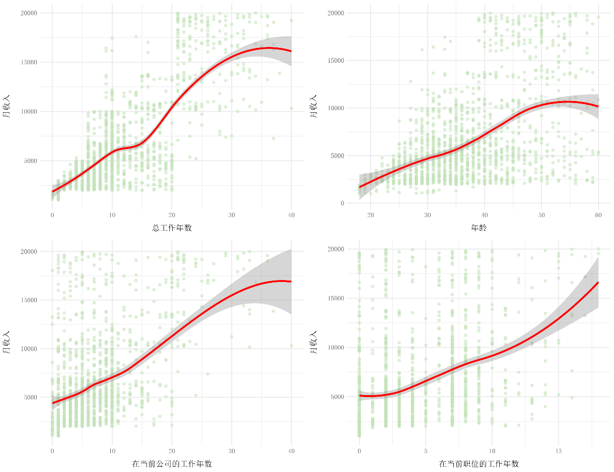

Fig 21 Bivariate analysis

# Decision Tree

A decision tree is a machine learning algorithm that is used to build
predictive models and perform classification or regression analysis. It
creates a tree-like structure by selecting the best features from the
dataset, with each internal node representing a feature and each leaf
node representing a category or a predicted outcome.

The advantage of a decision tree analyzing the influencing factors of
employee turnover is its explainability and ease of understanding. By
building a decision tree model, we can clearly understand which factors
have the greatest impact on employee turnover and identify the key
characteristics associated with attrition. Decision trees can also
provide decision rules to help managers develop effective intervention
and retention strategies for different groups of employees.

The benefits of using decision trees for employee turnover factor
analysis include:

1.  Explainability: The rules and paths generated by the decision tree model are easy to understand and interpret, allowing managers to gain insight into the causes and mechanisms of employee attrition.

2.  Trait importance assessment: Decision trees can assess the importance of traits based on their location and branches in the tree, helping managers identify the key factors that influence employee turnover.

3.  Visualization: The decision tree can be presented graphically, visually showing the relationship between different characteristics and decision-making paths, helping managers better understand the patterns and trends of employee attrition.

4.  Prediction and classification capabilities: Decision trees can be used to predict the probability of whether or may lose employees in the future, helping managers take timely action to reduce employee turnover.

5.  In summary, decision trees are a powerful tool that can help managers gain a deeper understanding of the influencing factors of employee turnover and develop management strategies accordingly to reduce employee turnover and improve the stability and sustainability of the organization.

## Split the training set and test set

Use createDataPartition in the caret package to split the training set
and test set, and check whether the training set and test set have the
same label ratio.

```
library(caret)
# Split the training set and the test set
trainIndex <- createDataPartition(df_zh$ churn, p=0.8, list=FALSE,
times=1)
train <- df_zh[trainIndex,]
test <- df_zh[-trainIndex,]
# Check whether the training set and the test set have the same
proportion of labels
prop_train <- train %>% select (churn) %>%
group_by(Churn) %>% summarize(n=n()) %>%
mutate(pct=round(prop.table(n), 2))
prop_test <- test %>% select (churn) %>%
group_by(Churn) %>% summarize(n=n()) %>%
mutate(pct=round(prop.table(n), 2))
```

See the results Fig 22 The proportion of labels in the training set and
the test set is the same, with 16% lost and 84% unlost, which is
reasonable.

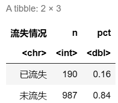
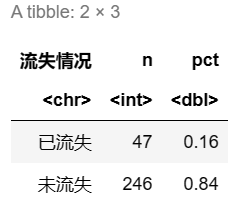

Fig 22 The ratio of labels to the test set

## Decision tree modeling and visualization

Use the rpart() method in the rpart package to build a decision tree
model, see the code below.

```
library(rpart)
# A decision tree model was constructed
tree <- rpart(churn ~., data=train).
```

Use the visTree() method in the visNetwork package to draw an
interactive decision tree, see below for the code.

```
library(visNetwork)
visTree(tree,height = "800px", colorY =
c("green","red","blue"))
```

See for decision trees Fig 23.

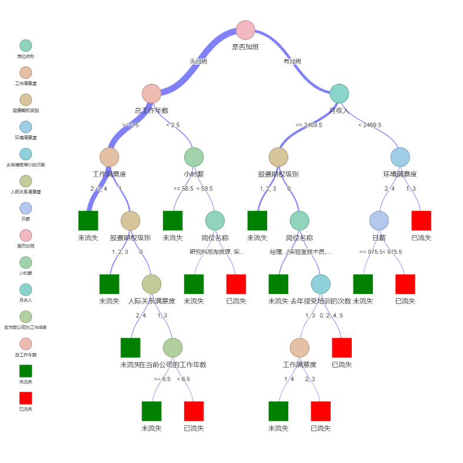

Fig 23 decision tree

For the purpose of commit readability, the decision tree is pruned using
the prune method.

```
prune.tree <- prune(tree, cp=0.02)
```

See you for the decision tree after pruning Fig 24. It can be seen that
the elimination of overtime can significantly improve churn.

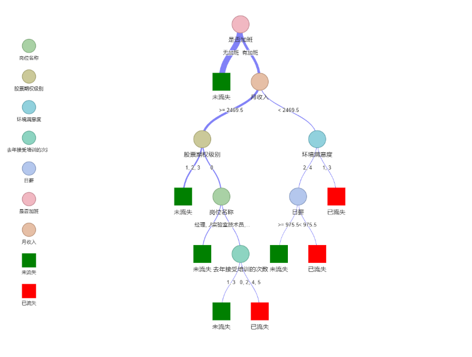

Fig 24 Decision tree after pruning

## Evaluate decision tree model performance

### Confusion matrix

The predict method is used to predict the decision tree using the
training set.

```
predictions <- predict(tree, test, type="class")
conf_df <- data.frame(table(test$churn, predictions))
# Drawing
ggplot(data = conf_df, mapping = aes(x = predictions, y = Var1)) +
geom_tile(aes(fill = Freq))
```

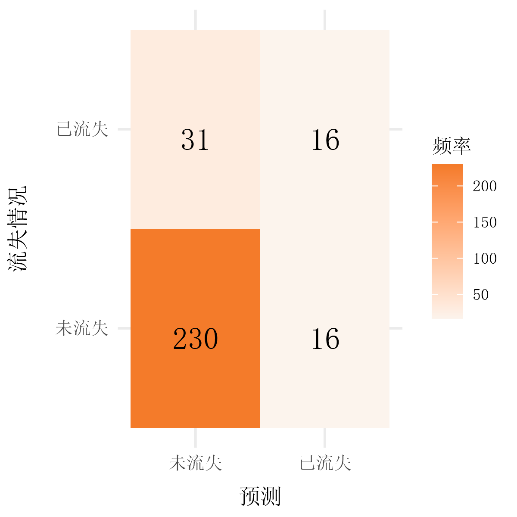

Fig 25 Confusion matrix

### Performance evaluation

By analyzing the confusion matrix, the following metrics can be derived
to evaluate model performance:

1.  Accuracy: The ratio of the number of samples correctly predicted by the model to the total number of samples, calculated as (TP + TN) / (TP + TN + FP + FN).

2.  Precision: The proportion of samples predicted by the model to be positive, calculated as TP / (TP + FP).

3.  Recall: The proportion of samples that are actually positive that the model correctly predicts to be positive, calculated as TP / (TP + FN).

4.  F1 Score: A metric that takes into account precision and recall, calculated as 2 * (Precision * Recall) / (Precision + Recall).

5.  Specificity: The proportion of samples that are actually negatives that the model correctly predicts as negatives, calculated as TN / (TN + FP).

The performance indicators are shown in Table 2. You can get:

1.  The accuracy of the model in the prediction is 16.08%. The overall performance of the model is low, and the degree to which the predicted results match the actual results is low.

2.  The proportion of samples correctly predicted as positive categories by the model accounted for 65.96% of all actual positive category samples. The model has a relatively good ability to recognize positive categories.

3.  The F1 score of the model is 0.2027, and the comprehensive performance is poor.

4.  The proportion of samples correctly predicted as negative by the model accounted for 6.41% of all actual negative class samples. This means that the model is less capable of recognizing negative categories.

Overall, the model performs poorly in terms of accuracy, precision, and specificity, and performs better in terms of recall. This could mean that the model has some ability to recognize positive categories, but is less capable of distinguishing negative categories.

2.  Decision tree model performance metrics

||Accuracy|Precision|Recall|F1|score|Specificity|
|-----------|-----------|-----------|-----------|-----------|-------------|
|score|0.1608|0.1189|0.6596|0.2027|0.0641|


## Feature importance analysis

The variable.importance attribute of the decision tree is used to
investigate the importance of the feature, and a histogram is drawn, as
shown in some of the codes.

```
var_imp <- data.frame(tree$variable.importance)
var_imp$features <- rownames(var_imp)
var_imp <- var_imp[, c(2, 1)]
var_imp$importance <- round(var_imp$tree.variable.importance, 2)
var_imp$tree.variable.importance <- NULL
# Drawing
var_imp %>%
ggplot(aes(x=reorder(features, importance), y=importance,
fill=features)) +
geom_bar(stat='identity', color="black", size=0.2)
```

Fig 26 The ranking of feature importance is displayed. The loss of
monthly income has the greatest impact, followed by the total number of
years of work, followed by whether to work overtime, position, and age.

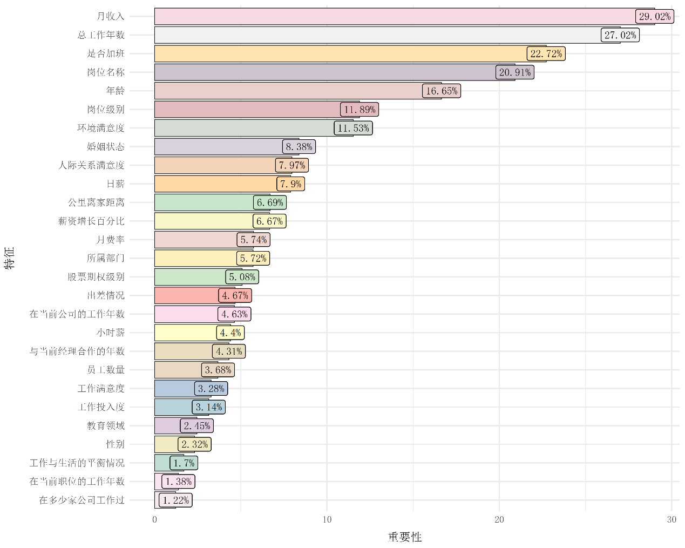

Fig 26 Feature importance

# H2O machine learning model

## Introduction to the H2O model

H2O is an open-source distributed machine learning platform that
provides a wealth of machine learning algorithms and tools to make
building and deploying machine learning models more efficient and
convenient. The H2O machine learning model has the following
characteristics:

1.  Distributed computing: H2O can process large-scale datasets on multiple computers in parallel, accelerating the model training and inference process through distributed computing, improving efficiency and performance.

2.  Multiple algorithm support: H2O supports a variety of machine learning algorithms, including decision trees, random forests, gradient boosters, deep learning, etc., and can select appropriate algorithms for modeling and analysis according to the characteristics of the problem.

3.  Automated machine learning (AutoML): H2O provides automated machine learning capabilities that automate feature engineering, model selection, and tuning to help users quickly build high-performance machine learning models.

4.  High performance and scalability: H2O is written in Java and uses an efficient parallel computing framework at the bottom layer, which has good performance and scalability, and is suitable for processing large-scale data and complex models.

Why use H2O machine learning models to analyze the factors influencing
employee turnover? Here are some reasons:

1.  Processing large-scale data: Employee attrition data can contain a large number of features and samples, and H2O's distributed computing power can efficiently process large-scale data sets and speed up model training and analysis.

2.  Multiple algorithm selection: H2O provides a variety of machine learning algorithms, which can be modeled according to the characteristics of the data, so as to obtain more accurate and reliable results.

3.  Automated modeling: H2O's AutoML function can automate the process of feature engineering, model selection, and tuning, reducing tedious manual parameter tuning and improving the efficiency and accuracy of modeling.

4.  Explainability and visualization: H2O can provide explanatory and visual capabilities of the model to help managers understand the predictive outcomes and influencing factors of the model so that they can better formulate employee retention strategies.

5.  In summary, the H2O machine learning model has the advantages of high performance, diverse algorithm support, and automated feature engineering, making it a powerful tool for analyzing the influencing factors of employee turnover. By leveraging the H2O platform, you can quickly and accurately analyze the causes of employee turnover and take corresponding management measures to improve employee satisfaction and retention, thereby improving the stability and competitiveness of the organization.

Start the model with h2o.init(), see below for the code.

```
library(h2o)
# Start the model
h2o.init()
# Change the data frame to H2O format
h2o_df <- as.h2o(df_train)
```

Feedback on the success of the model startup is shown Fig 27.

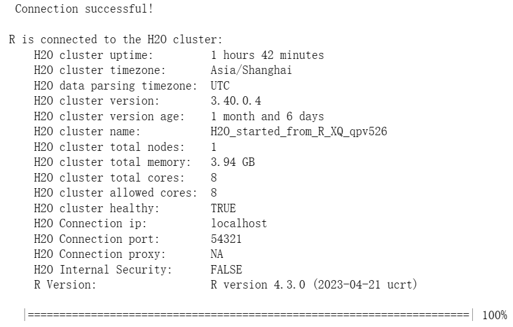

Fig 27 The H2O model is successfully launched

## Split the training set, test set, and validation set

Use the splitFrame method to mark the split, and assign to perform the
split.

```
# Split the training set, test set, and validation set
split_df <- h2o.splitFrame(h2o_df, c(0.7, 0.15), seed=12)
h2o_train <- h2o.assign(split_df[[1]], "train")
h2o_validation <- h2o.assign(split_df[[2]], "validation")
h2o_test <- h2o.assign(split_df[[2]], "test")
```

Use the describe method to view the descriptive statistics of H2O data
frames.

```
h2o.describe(h2o_train)
```

See the results Fig 28. The meaning of the header is, in order:

1.  Label: Column name, which indicates the name of the column in the data frame.

2.  Type: The data type of the column, indicating the type of value stored in the column (e.g., numeric, text, and so on).

3.  Missing: The number of missing values, which indicates the number of missing (null values) in the column.

4.  Zeros: The number of zero values, which represents the number of values that are zero in the column.

5.  PosInf: The number of positive infinity that represents the number of positive infinity values in the column.

6.  NegInf: The number of negative infinity that represents the number of negative infinity values in the column.

7.  Min: The minimum value in the column.

8.  Max: The maximum value in the column.

9.  Mean: Average, which represents the average value in the column.

10. Sigma: Standard deviation, which represents the standard deviation of the values in the column (a measure of how discrete the data is).

11. Cardinality: Cardinality, which represents the number of distinct values in the column (the number of unique values).

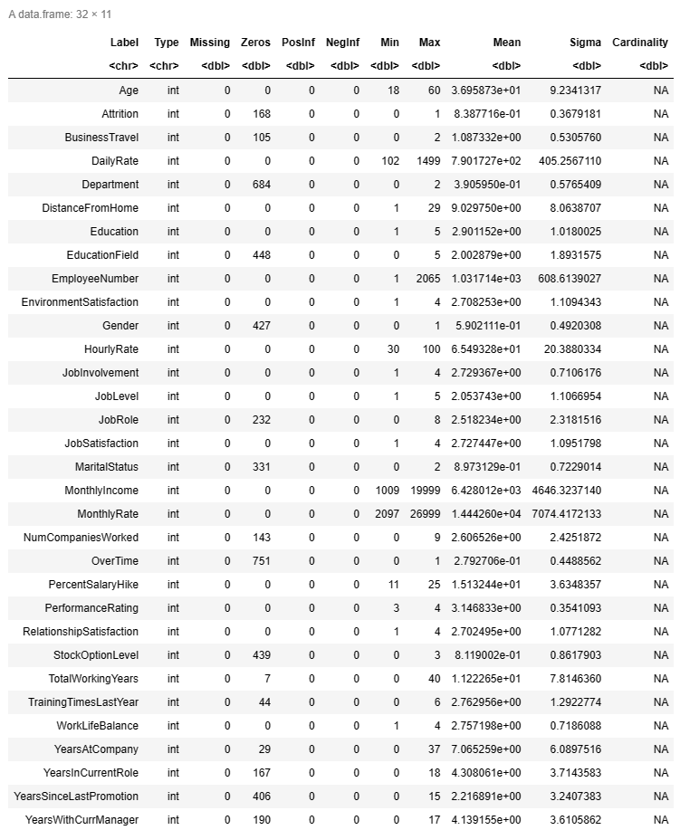

Fig 28 View descriptive statistics for H2O dataframes

## Build a model

Use H2O AutoML to run an automated machine learning process that automatically builds and evaluates multiple models based on a given training dataset with churn as the target variable, and generates a model leaderboard. See below for the code. When the progress bar reaches 100%, the build is successful.

```
y <- "Attrition"
x <- setdiff(names(h2o_train), y)
auto_ml <- h2o.automl(
y = y, # specify the target variable
x = x, # specifies the characteristic variable
training_frame = h2o_train, # Specify the dataset to be used for
training
leaderboard_frame = h2o_validation, # specifies the dataset used to
generate the leaderboard
project_name = "Attribution", max_models = 10, seed = 12
)
```

Bug Reports:

```
AutoML: XGBoost is not available; skipping it.
```

The query found that the following reasons were obtained: AutoML could
not build XGBoost models on Windows. There is currently no way to
resolve this error.

## Model sorting

### Ranking of model prediction effects

View the ranking of model prediction performance in the leaderboard.

```
top_models <- auto_ml@leaderboard
print(top_models)
```

The ranking results of the model prediction effect are shown in the
following tables Fig 29.

1.  model_id is a unique identifier for a model that is used to distinguish between different models.

2.  rmse (Root Mean Squared Error) is the root of the mean of the square of the difference between the predicted value and the actual observed value. It is a common metric to measure the accuracy of a predictive model, with smaller numbers indicating better predictions for the model.

3.  mse (Mean Squared Error) is the mean squared error that represents the difference between the predicted value and the actual observed value. It is a measure of the average prediction error of a predictive model, with smaller numbers indicating better predictions of the model.

4.  mae (Mean Absolute Error) is the mean absolute error, which represents the average of the absolute value of the difference between the predicted value and the actual observed value. It is a measure of the average prediction error of a predictive model, with smaller numbers indicating better predictions of the model.

5.  rmsle (Root Mean Squared Logarithmic Error) is the root mean square error, which is the root mean square calculation of the logarithmic difference between the predicted value and the actual observed value. It is useful when dealing with target variables of varying orders of magnitude, with smaller values indicating better predictions for the model.

6.  mean_residual_deviance is the mean residual bias, which represents the ratio of the sum of squares of the residuals of the model to the sample size. It is a measure of how well the model fits, and the lower the number, the better the fit of the model.

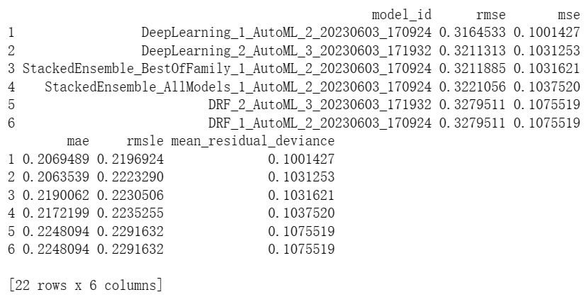

Fig 29 Ranking of model prediction effects

### Model importance

Compare the importance of different models in StackedEnsemble_BestOfFamily ensemble models. StackedEnsemble_BestOfFamily is an ensemble learning model that consists of multiple underlying models and integrates their predictions through a combination strategy. By choosing the best model (best_family) among the StackedEnsemble_BestOfFamily models, you can get the best prediction performance. For this model, the importance of the individual eigenvariables can be further analyzed (via the h2o.varimp function) to understand how much they contribute to the prediction results. See below for the code.

```
model_id <- as.data.frame(top_models$model_id)[,1]
best_family <- h2o.getModel(grep("StackedEnsemble_BestOfFamily",
model_id, value=TRUE)[1])
obtain_model <- h2o.getModel(best_family@model$metalearner$name)
# Drawing
h2o.varimp_plot(obtain_model)
```

Fig 30 The ranking of model importance is shown, and the top three models
will be used for feature importance analysis.

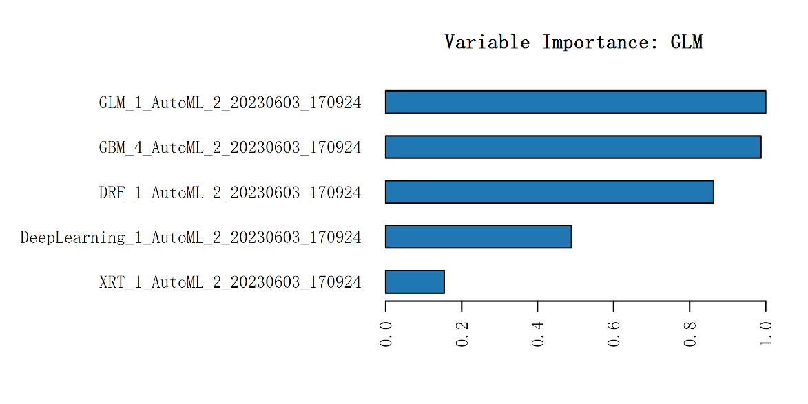

Fig 30 Model importance ordering

## Feature importance

In this section, GLM, GBM, and DRF models are used to investigate
feature importance. See below for some of the codes.

```
xgb <- h2o.getModel(grep("GBM", model_id, value = TRUE)[1])
h2o.varimp_plot(xgb)
```

The ranking results of feature importance based on GLM, GBM and DRF
models are shown separately Fig 31、Fig 32、Fig 33. Based on the results
of each model, the factors that affect employee turnover the most are
overtime, monthly income, and age.

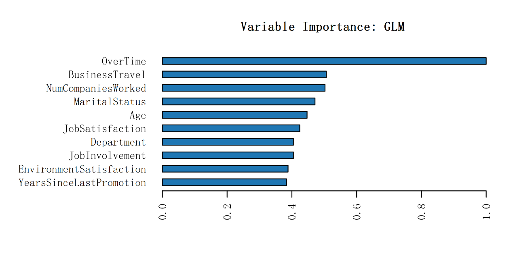

Fig 31 Feature importance based on GLM model

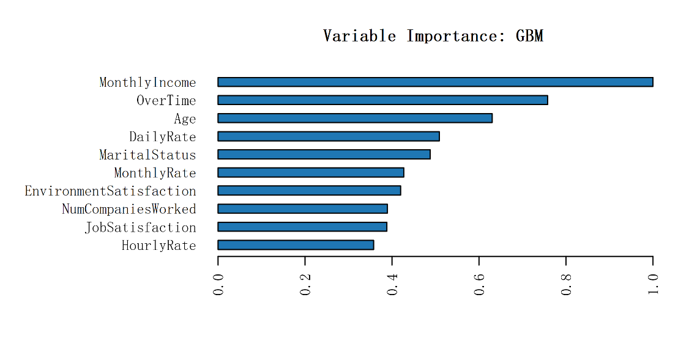

Fig 32 Feature importance based on the GBM model

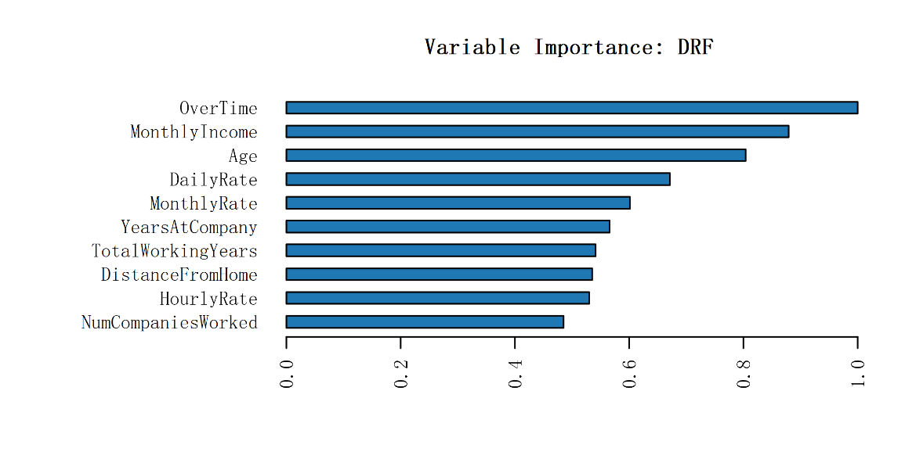

Fig 33 Feature importance based on DRF model

# Management Implications

The most significant factors influencing employee turnover are overtime,
income, and age, followed by satisfaction and total years of service.
Surprisingly, age, which is also the underlying demographic factor, has
a very significant effect on attrition, while gender has little or no
effect on attrition. For other demographic characteristics, the degree
of influence of marital status is not obvious, and the relatively low
level of education is more likely to cause loss. Departments and
positions have a certain impact, but the extent is not obvious. While
the impact on revenue is significant, performance ratings have little to
no effect on churn. In terms of work status, only environmental
satisfaction had a significant impact on churn, and work-life balance
had no significant effect.

The above conclusions provide the following management implications for
managers to help reduce the rate of employee attrition:

1.  Overtime Situation Management: Reduce situations of excessive overtime, provide appropriate working hours and workload management to avoid employees feeling tired and dissatisfied due to excessive overtime.

2.  Revenue management: Ensure that employees are paid at the right level and offer competitive compensation and benefits to attract and retain top employees.

3.  Age management: Pay attention to the age characteristics of employees, and provide development opportunities and benefits that adapt to the needs of employees of different ages to enhance their sense of belonging and job satisfaction.

4.  Satisfaction management: Pay attention to the job satisfaction of employees, and improve employee satisfaction and work motivation by providing a good working environment, training and development opportunities.

5.  Total Years of Work Management: Pay attention to the work experience and development of employees, provide them with promotion opportunities, career development planning, etc., to increase their job stability and loyalty.

6.  Other demographic management: Although gender and marital status have little impact on employee turnover, it is still necessary to pay attention to the individual needs of employees and equal treatment to avoid unfair phenomena caused by demographic factors.

7.  Department and post management: pay attention to the characteristics of departments and positions, and provide employees with corresponding resource support and development opportunities to improve their sense of belonging and job satisfaction.

8.  Performance rating management: Emphasize the fairness and accuracy of performance ratings, ensure that performance ratings are consistent with the actual performance of employees, and avoid the negative impact of performance ratings on employee turnover.

9.  Work-Life Balance Management: Pay attention to employees' work-life balance and provide flexible work arrangements and support measures to reduce employee turnover due to excessive work stress.

# Appendix List of packages {#appendix-list-of-packages .unnumbered}

```
Library(dplyr) # provides data processing and data transformation
functions, including data filtering, variable manipulation, grouping
and summarization, data connection, etc.
library(tidyverse) # A data science toolset that includes multiple
packages (e.g., dplyr, ggplot2, tidyr, etc.) that provides data
processing, visualization, and data analysis capabilities.
library(Cairo) # provides a high-quality vector graphics device that
can be used to generate various types of graphics output.
library(cowplot) # is a package for creating complex graph layouts
and compositions that can combine multiple graphs into a single
graph.
library(plotrix) # provides a number of functions for plotting
special and custom graphs.
library(viridis) # provides a set of color palettes for creating
beautiful, continuous color mappings.
library(ggcorrplot) # provides a function for plotting a correlation
matrix, which can show the correlation between variables in the form
of a heat map.
library(caret) # provides functions and tools commonly used in
machine learning and data mining, including data preprocessing,
feature selection, model training and evaluation, and more.
library(rpart) # provides functions for building decision tree
models for classification and regression problems.
library(visNetwork) # provides the ability to create interactive
network diagrams that can be used to visualize complex network
structures.
library(RColorBrewer) # provides a set of color palettes for
creating high-quality color mappings.
Library(H2O) # provides functions and tools for large-scale machine
learning and deep learning, supporting distributed computing and
parallel processing. Large datasets can be processed and model
training, prediction, and evaluation can be performed.
```